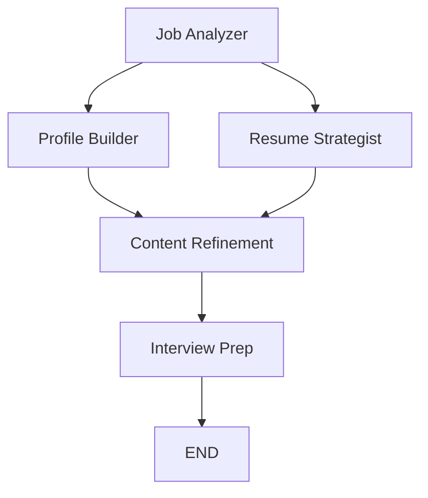

# 🧠 Multi-Agent Career Assistant

A production-style multi-agent AI system built with LangGraph and local LLMs (Ollama) that helps software engineers optimize their career path.

The system analyzes job postings, evaluates candidate profiles, and generates personalized outputs such as:
- Resume optimization
- Skill gap analysis
- Interview preparation
- Career recommendations

---

# 🚀 Key Features

- 🧩 Multi-agent architecture using LangGraph
- 🧠 Local LLM support (Ollama: Llama / Qwen / Mistral)
- 📄 Job posting analysis
- 👤 Candidate profile extraction (GitHub + resume)
- ✍️ Resume tailoring (ATS optimization)
- 🎯 Interview question generation
- 📊 Skill gap analysis
- 🔄 State-based workflow execution

---

# 🏗️ System Architecture

The system is built as a directed graph of specialized AI agents with parallel execution:



**Agents:**
- **Job Analyzer**: Extracts key skills and requirements from job postings
- **Profile Builder**: Builds professional profiles using GitHub data and job analysis
- **Resume Strategist**: Creates tailored resume drafts based on job requirements
- **Content Refinement**: Improves resume clarity, structure, and professionalism
- **Interview Prep**: Generates interview questions and preparation tips

Each agent operates on a shared Pydantic state object and contributes to the final output.

---

# 🧠 Why LangGraph?

Unlike traditional agent frameworks, LangGraph provides:

- Explicit control over execution flow
- Stateful multi-step reasoning
- Deterministic orchestration
- Production-grade agent pipelines

---

# 🛠️ Tech Stack

- Python 3.11
- LangGraph
- LangChain
- Ollama (local LLM runtime)
- Qwen2.5:7b model
- Pydantic (structured state)
- Requests (API calls)

---

# 📦 Installation

## Prerequisites

- Fedora 44 (or similar Linux distro)
- Micromamba (conda alternative)
- Ollama installed and running
- Qwen2.5:7b model downloaded

## Setup

1. **Clone the repository:**
   ```bash
   git clone https://github.com/damian-r-s/multi-agent-career-assistant.git
   cd multi-agent-career-assistant
   ```

2. **Create environment:**
   ```bash
   micromamba create -f environment.yml
   micromamba activate multi-agent-career-assistant
   ```

3. **Install Ollama and model:**
   ```bash
   # Install Ollama (if not already)
   curl -fsSL https://ollama.ai/install.sh | sh

   # Pull the model
   ollama pull qwen2.5:7b
   ```

4. **Verify setup:**
   ```bash
   python main.py
   ```

---

# 🚀 Usage

## Basic Usage

```python
from input_handler import prepare_initial_state
import graph

# Prepare input
job_posting = "Senior Python Engineer with ML experience..."
initial_state = prepare_initial_state(job_posting)

# Run the system
result = graph.agent.invoke(initial_state)

print("Resume:", result['refined_output'])
print("Interview Prep:", result['interview_prep'])
```

## With GitHub Profile

```python
initial_state = prepare_initial_state(
    job_posting="...",
    github_username="your-github-username"
)
```

## With Resume File

```python
initial_state = prepare_initial_state(
    job_posting="...",
    resume_path="/path/to/resume.txt"
)
```

## Command Line

```bash
micromamba activate multi-agent-career-assistant
python main.py
```

---

# 📁 Project Structure

```
multi-agent-career-assistant/
├── agents/                    # Individual agent implementations
│   ├── job_analyzer.py
│   ├── profile_builder.py
│   ├── resume_strategist.py
│   ├── content_refinement.py
│   └── interview_prep.py
├── tools/                     # Utility tools
│   ├── file_reader.py
│   └── github_api.py
├── prompts/                   # Agent prompts (future)
├── state/                     # State definitions
├── graphs/                    # Graph configurations (future)
├── main.py                    # Entry point
├── graph.py                   # Main graph definition
├── state.py                   # Pydantic state model
├── input_handler.py           # Input processing
├── environment.yml            # Dependencies
└── README.md
```

---

# 🤝 Contributing

1. Fork the repository
2. Create a feature branch
3. Make your changes
4. Add tests if applicable
5. Submit a pull request

---

# 📄 License

MIT License - see LICENSE file for details

---

# 🙏 Acknowledgments

- LangGraph for the agent orchestration framework
- Ollama for local LLM support
- Qwen team for the excellent model

---