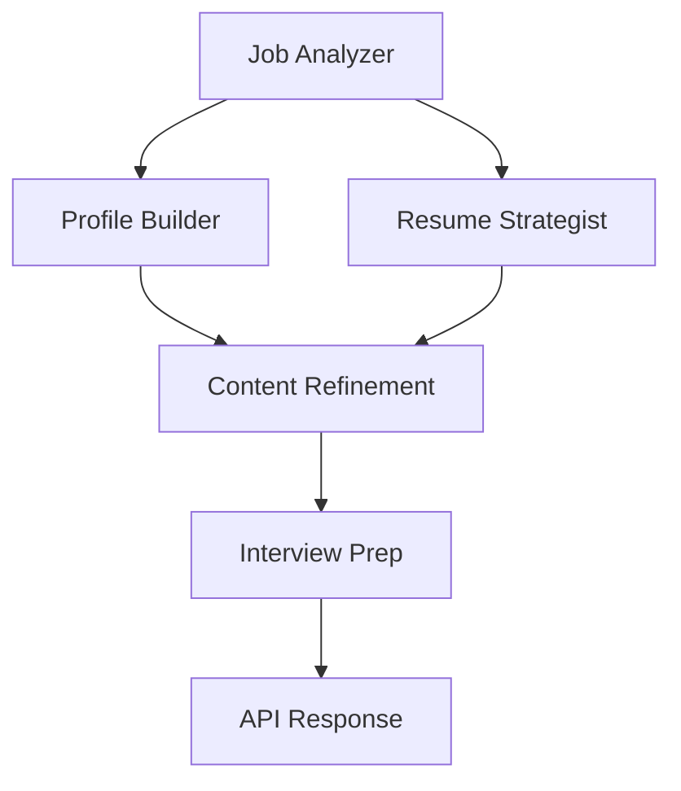

# 🧠 Multi-Agent Career Assistant

A production-grade, multi-agent AI system for job analysis, resume optimization, and interview preparation — now publicly available online.

---

# 🚀 Live Deployment

The application is deployed and accessible here:

👉 **https://multi-agent-career-assistant.onrender.com/**

Production environment:
- Render Cloud (Docker container)
- FastAPI backend + static frontend
- Multi-agent pipeline orchestrated with LangGraph
- Optional integration with local or remote Ollama LLM

---

# ✨ Key Features

- 🧩 Multi-agent architecture (LangGraph DAG)
- 🧠 LLM-ready design (Ollama / OpenAI compatible)
- 📄 Job posting analysis
- 👤 GitHub profile extraction
- ✍️ Resume optimization (ATS-focused)
- 🎯 Interview preparation
- 📊 Skill gap analysis
- 🌐 REST API (FastAPI)
- 🐳 Dockerized deployment
- ☁️ Cloud hosting on Render

---

# 🏗️ System Architecture



---

# 🌐 Production API Base URL

All API calls should target:

```
https://multi-agent-career-assistant.onrender.com
```

Endpoints:

| Endpoint | Method | Description |
|---------|--------|-------------|
| `/api/analyze` | POST | Full multi-agent job analysis |
| `/health` | GET | Health check |

---

# ⚠️ Notes About the Hosted Version

- Render free tier may introduce **cold starts** (5–10 seconds).
- Ollama **cannot run inside Render** — use local or remote LLM.
- Tavily API key is required for job URL extraction.
- GitHub API rate limits may apply.

---

# 📂 Directory Structure

```
multi-agent-career-assistant/
│
├── src/
│   ├── state.py
│   ├── llm.py
│   ├── graph.py
│   ├── input_handler.py
│   ├── agents/
│   └── tools/
│
├── static/
│   ├── index.html
│   ├── style.css
│   └── script.js
│
├── app.py
├── main.py
├── requirements.txt
├── README.md
└── LICENSE
```

---

# 🔌 API Usage Examples

### cURL

```bash
curl -X POST https://multi-agent-career-assistant.onrender.com/api/analyze \
  -F "job_url=https://example.com/job" \
  -F "github_username=yourname"
```

### Python

```python
import requests

data = {
    "job_url": "https://example.com/job",
    "github_username": "yourname"
}

response = requests.post(
    "https://multi-agent-career-assistant.onrender.com/api/analyze",
    data=data
)

print(response.json())
```

---

# 🛠️ Local Development (Optional)

### Install dependencies

```bash
pip install -r requirements.txt
```

### Start Ollama

```bash
ollama serve
```

### Run FastAPI

```bash
uvicorn app:app --reload --host 0.0.0.0 --port 8000
```

---

# 📦 Deployment (Render)

The production deployment uses:

- Dockerfile
- Render Blueprint
- Single-container deployment

---

# 📈 Future Enhancements

- Authentication & user accounts
- PDF/DOCX export
- Real-time WebSocket updates
- Database for history tracking

---

# 📜 License

MIT License
